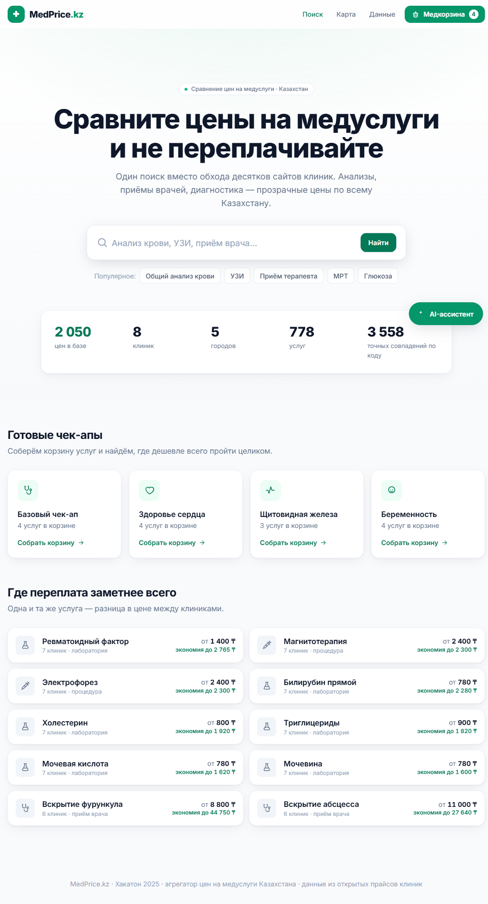
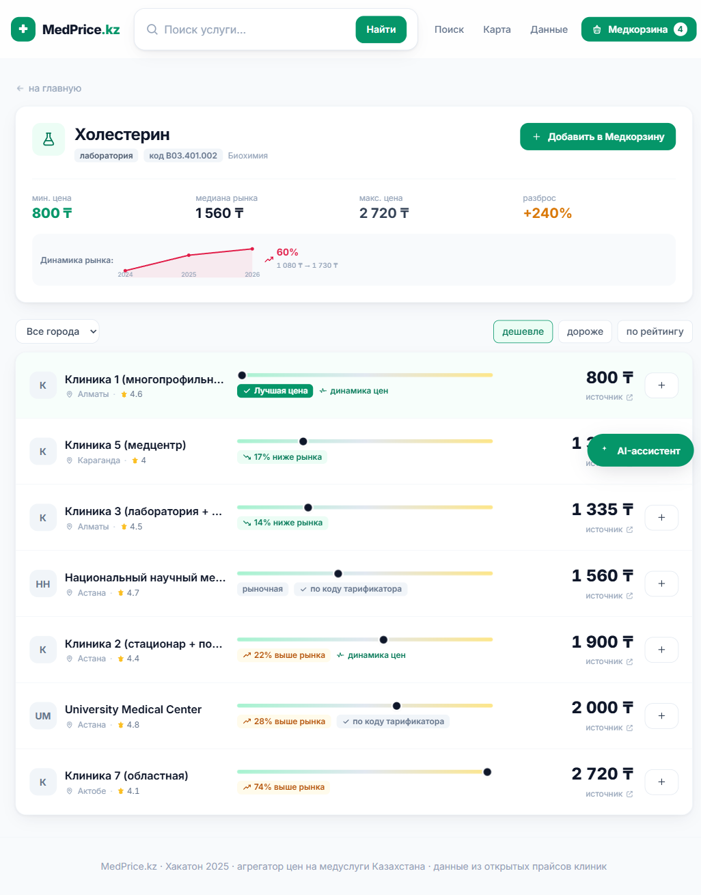
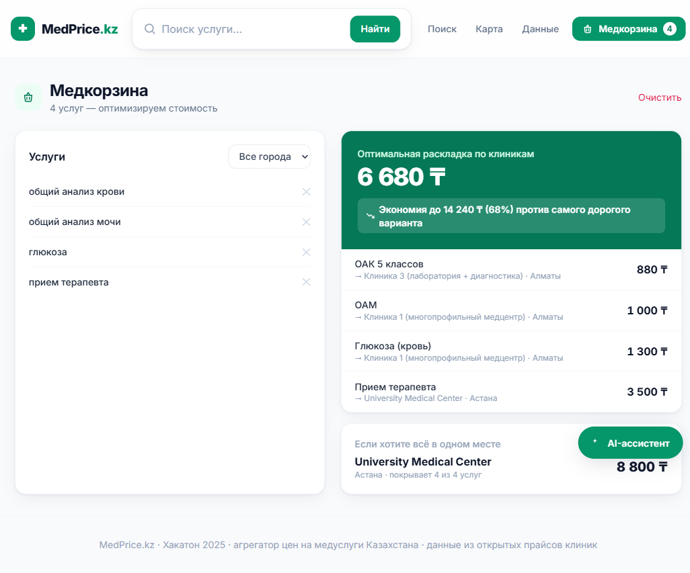
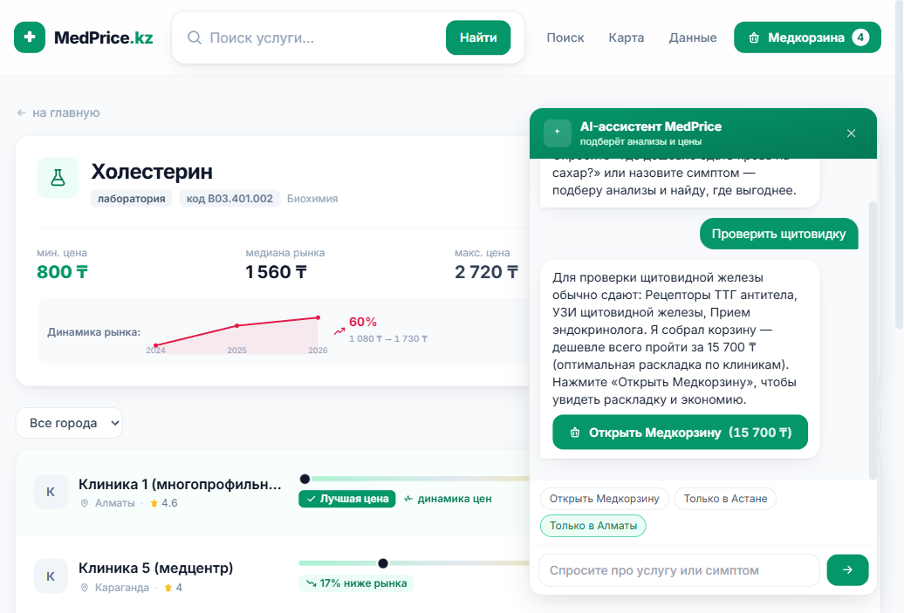
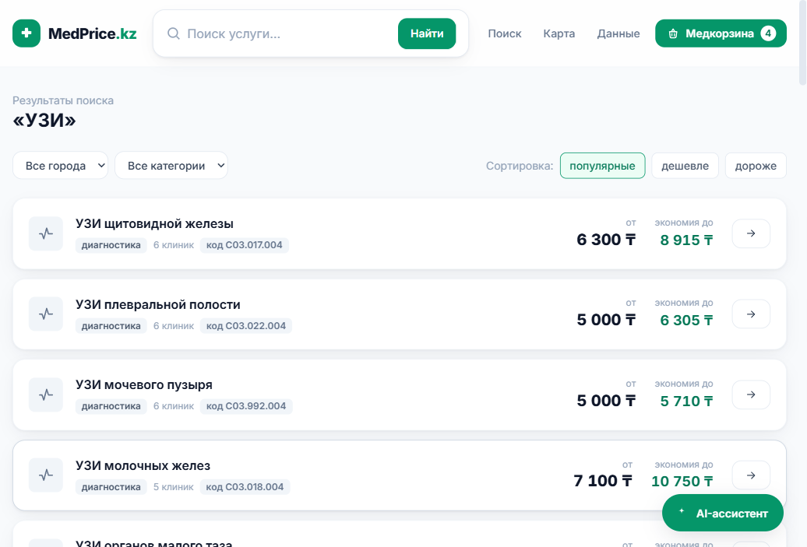
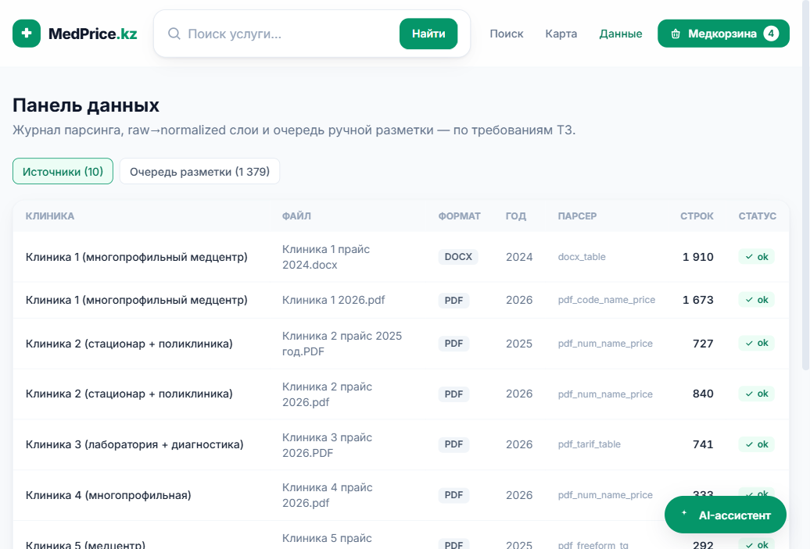
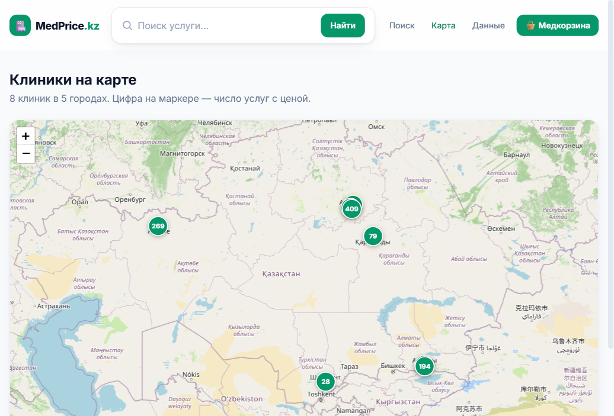

# 🏥 MedPrice.kz — агрегатор цен на медицинские услуги Казахстана

> «Aviasales для медицины»: один поиск вместо обхода десятков сайтов клиник.
> Хакатон 2026, кейс **MedServicePrice.kz**.

**▶ Живое демо: https://medtech-self.vercel.app**

Пациент больше не обходит десятки сайтов, чтобы сравнить стоимость анализа крови
или приёма врача. MedPrice.kz собирает прайсы клиник из разнородных источников
(PDF, DOCX, Excel, HTML), приводит названия к единому справочнику и даёт быстрый
поиск, сравнение и **оптимизацию корзины услуг** по цене.

---

## 🖼 Скриншоты

| Главная | Сравнение цен (честная цена) |
|---|---|
|  |  |
| **Медкорзина — оптимизатор** | **AI-ассистент** |
|  |  |
| **Выдача поиска** | **Админ: журнал парсинга** |
|  |  |
| **Карта клиник** | |
|  | |

---

## 🚀 Быстрый запуск

Нужны **Python 3.11+** и **Node.js 18+**.

### 1. Бэкенд (API)
```bash
cd backend
pip install -r requirements.txt
python -m uvicorn app.main:app --port 8000
```
API на http://127.0.0.1:8000 · Swagger-доки: http://127.0.0.1:8000/docs

> **База данных уже собрана** и включена в репозиторий (`backend/data/medservice.db`) —
> перепарсинг для запуска не нужен. Чтобы пересобрать из исходников
> (`python -m pipeline.run_pipeline`), положите в корень прайс-файлы 8 клиник и
> `Справочник услуг.xlsx` (предоставлены организаторами — в submission не входят).

### 2. Фронтенд (React)
```bash
cd frontend
npm install
npm run dev
```
Откройте **http://127.0.0.1:5173**

> Windows: можно запустить всё одним кликом — `run.bat` в корне репозитория.

---

## 📊 Что в базе (реальные спарсенные данные)

| Показатель | Значение | Минимум по ТЗ |
|---|---:|---:|
| Источников (файлов) | **10** | — |
| Клиник | **8** | — |
| Городов | **5** (Астана, Алматы, Шымкент, Караганда, Актобе) | — |
| Сырых строк (raw-слой) | **14 832** | — |
| Нормализованных цен | **5 916** | — |
| Предложений (клиника×услуга) | **2 050** | — |
| Уникальных услуг с ценой | **778** | ≥ 100 |
| Позиций в справочнике | **1 230** | ≥ 50 |
| Точных совпадений по коду тарификатора | **3 558** (conf 1.0) | — |
| Записей истории цен (по годам) | **2 357** | — |

Все 8 прайсов организаторов распарсены (PDF/DOCX/XLS/XLSX), включая сканы с
OCR-шумом. Источник каждой цены сохранён в raw-слое для аудита.

---

## 🎯 Чем выигрываем (фичи сверх ТЗ)

0. **🤖 AI-ассистент (чат-бот).** Спросите своими словами — «где дешевле сдать кровь
   на сахар в Астане?» или назовите симптом «болит горло», «проверить щитовидку» —
   ассистент поймёт, подберёт анализы, найдёт клиники с ценами и **соберёт
   чек-ап-корзину**. Работает на наших реальных данных (без галлюцинаций), офлайн,
   без ключей. Опционально усиливается **бесплатным LLM** (Gemini/Groq) — см. ниже.
1. **🧺 Медкорзина — оптимизатор стоимости.** Соберите корзину услуг (или готовый
   чек-ап) — система считает **самую дешёвую раскладку по клиникам** И альтернативу
   «всё в одной клинике», показывает экономию. Это настоящий аналог Aviasales для
   медицины. *(Демо: базовый чек-ап — экономия до 68%.)*
2. **📈 Реальная история цен.** В данных есть прайсы 2024/2025/2026 с едиными кодами
   услуг — показываем настоящую динамику год-к-году (не синтетика).
3. **🎯 Нормализация по коду тарификатора.** Официальный код (есть и в справочнике,
   и в прайсах клиник) — точный якорь сопоставления: 3 558 совпадений с confidence 1.0.
   Чиним OCR-гомоглифы: «ВОЗ.335» → «B03.335».
4. **⚖️ «Честная цена».** Для каждой услуги — медиана и перцентили рынка, бейджи
   «ниже рынка / рыночная / выше рынка», позиция цены на шкале.
5. **🗺 Карта клиник** (Leaflet), **🩺 готовые чек-апы** (сердце, щитовидка,
   беременность), **🛠 админ-панель** парсинга и очередь ручной разметки.

---

## 🤖 AI-ассистент: включить бесплатный LLM (опционально)

По умолчанию ассистент работает на нашем движке (интенты + реальные данные) —
**без интернета и ключей**, ничего настраивать не нужно. Чтобы ответы стали
ещё более «живыми», можно подключить бесплатный LLM — задайте один из ключей
перед запуском бэкенда:

```bash
# Вариант A — Google Gemini (бесплатный ключ: https://aistudio.google.com/apikey)
set GEMINI_API_KEY=ваш_ключ        # Windows (cmd)
$env:GEMINI_API_KEY="ваш_ключ"     # Windows (PowerShell)

# Вариант B — Groq (бесплатный ключ: https://console.groq.com/keys)
set GROQ_API_KEY=ваш_ключ
```

Движок сам подхватит ключ: ответы перефразируются живым языком **строго по
найденным данным** (цены не выдумываются). Нет ключа — используются аккуратные
шаблоны. Демо работает в обоих режимах.

---

## 🏗 Архитектура

```
Источники (PDF/DOCX/XLS/XLSX/HTML)
        │
        ▼
┌─────────────────┐   pluggable-парсеры по форматам (parsers.py)
│  ПАРСЕР          │   очистка OCR, выбор тарифа РК, заголовки разделов
└────────┬────────┘
         ▼
┌─────────────────┐   raw_prices — сырьё как в источнике (аудит ≥90 дней)
│  RAW-СЛОЙ        │
└────────┬────────┘
         ▼
┌─────────────────┐   каскад: код тарификатора → точное имя → синоним → fuzzy
│  НОРМАЛИЗАЦИЯ    │   confidence-оценка · непривязанное → очередь разметки
└────────┬────────┘
         ▼
┌─────────────────┐   normalized_prices · offers (витрина) · price_history
│  SQLite          │   · unmatched (очередь)
└────────┬────────┘
         ▼
┌─────────────────┐   FastAPI: /search /service /basket/optimize /history ...
│  API             │
└────────┬────────┘
         ▼
   React + Vite + Tailwind  (поиск · сравнение · медкорзина · карта · админка)
```

**Технологии:** Python · FastAPI · SQLite · pdfplumber · python-docx · openpyxl ·
rapidfuzz · React · Vite · Tailwind · Leaflet.

### Слои данных (требование ТЗ §3)
- **raw_prices** — сырые строки отдельно от нормализованных (аудит, дедуп).
- **normalized_prices** — привязка к справочнику + метод и confidence матча.
- **offers** — витрина «актуальная цена клиника×услуга» для быстрого поиска.
- **price_history** — цена по годам для трендов.
- **unmatched** — очередь ручной разметки с AI-подсказкой.

### Как добавить источник
1. Положить файл, добавить запись в `pipeline/config.py` (`SOURCES`).
2. При новом формате — добавить парсер в `pipeline/parsers.py` (контракт:
   `parse_source(meta) -> list[row]`).
3. `python -m pipeline.run_pipeline`. Ядро не меняется (требование масштабируемости ТЗ).

---

## ✅ Соответствие ТЗ

| Требование ТЗ | Статус |
|---|---|
| Парсер HTML/PDF/DOCX/Excel | ✅ PDF/DOCX/XLS/XLSX (8 клиник), HTML — расширяемо |
| Дедупликация при повторном запуске | ✅ идемпотентный upsert |
| Журналирование ошибок парсинга | ✅ таблица `sources` (статус/ошибка), админка |
| Raw-слой отдельно от нормализованных | ✅ `raw_prices` ↔ `normalized_prices` |
| Запуск парсинга вручную/по расписанию | ✅ CLI `run_pipeline` (cron-ready) |
| Справочник: id, название, синонимы, категория | ✅ `services` |
| Нормализация (алгоритм/AI) | ✅ код тарификатора + синонимы + fuzzy |
| Очередь ручной разметки (unmatched) | ✅ `unmatched` + AI-подсказка |
| Поиск с автодополнением | ✅ |
| Фильтры: город, категория, цена, рейтинг | ✅ |
| Сортировка: цена, рейтинг, дата | ✅ |
| Карточка клиники | ✅ |
| Дата обновления цены | ✅ `parsed_at`, год |
| Адаптивный интерфейс | ✅ |
| Доп: карта, история цен, сравнение, корзина | ✅ всё + оптимизатор корзины |

---

## 📁 Структура

```
medtech/
├── backend/
│   ├── pipeline/        # ETL: config, db, parsers, normalize, run_pipeline
│   ├── app/main.py      # FastAPI
│   └── data/medservice.db
├── frontend/            # React + Vite + Tailwind
│   └── src/             # Home, Results, ServiceDetail, Basket, MapView, Admin
├── Клиника*.pdf/docx/xls/xlsx   # исходные прайсы
├── Справочник услуг.xlsx
├── README.md
└── PRESENTATION.md      # аутлайн презентации + сценарий демо
```

---

## 🔒 Этика и правила
Парсятся только открытые публичные прайсы. Персональные данные пациентов не
собираются. Источник каждой цены сохраняется; дата парсинга показывается
пользователю (прозрачность).
